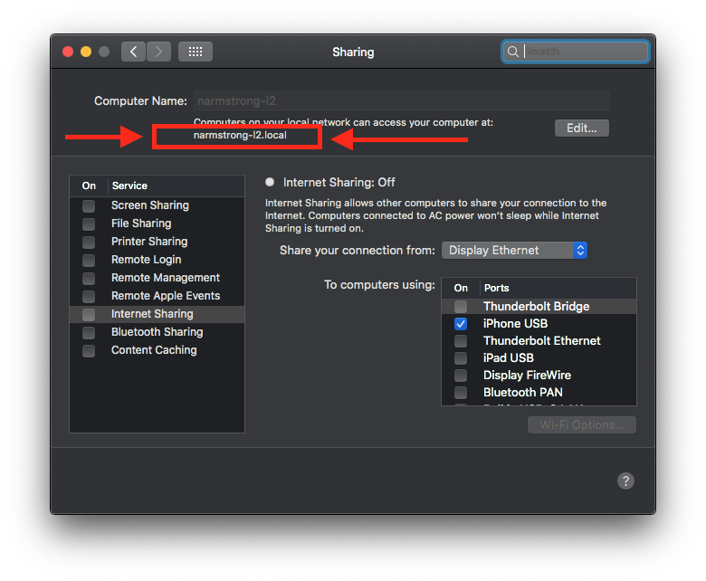

# DemoUniversalLinks

Hits a local [Sinatra](http://sinatrarb.com) app to demonstrate handling a
universal link from a http redirect.

## TL;DR

`WKWebView` will not launch universal links that occur as part of a http redirect.
You must intercept the redirect and call `UIApplication.shared.open(url)` to
trigger the universal link.

```swift
func webView(_ webView: WKWebView, decidePolicyFor navigationAction: WKNavigationAction, decisionHandler: @escaping (WKNavigationActionPolicy) -> Void) {
    if let url = navigationAction.request.url, url.host == "sso.canvaslms.com" {
        UIApplication.shared.open(url)
        decisionHandler(.cancel)
        return
    }
    decisionHandler(.allow)
}
```

## Setup

### Install dependencies.

```
bundle install
```

### Edit host machine name

Edit `DemoUniversalLinks/ViewController.swift` to use your machine's name.

```diff
// ViewController.swift
- webView.load(URLRequest(url: URL(string: "http://<host name>:8080/redirect")!))
+ webView.load(URLRequest(url: URL(string: "http://mymachine:8080/redirect")!))
```

You can find your machine name in `System Preferences > Sharing`.



### Start the Server

```
ruby server.rb
```

## Running the app

Install the [Canvas app](https://apps.apple.com/us/app/canvas-student/id480883488) on your physical device.

Open `DemoUniversalLinks.xcodeproj` in Xcode 10.2+.

Run the `DemoUniversalLinks` scheme on your physical device.

Once the app loads, tap Canvas in the top right.

The native Canvas app should launch.

The server log should show a call was made to `/redirect`.
